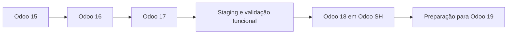

# Arquitectura de Migrações Odoo

Cada evolução exige auditoria dos módulos customizados, validação de dependências, testes funcionais por área de negócio e plano de rollback. Odoo SH fornece o fluxo de branches, build, staging e promoção para produção.
