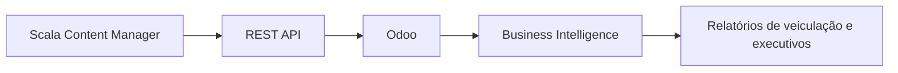

# Arquitectura Scala Content Manager API

A integração centraliza campanhas, ocupação de painéis e ciclo de vida operacional no Odoo. A camada de BI transforma esses dados em indicadores e relatórios para equipas operacionais, clientes e gestão.
